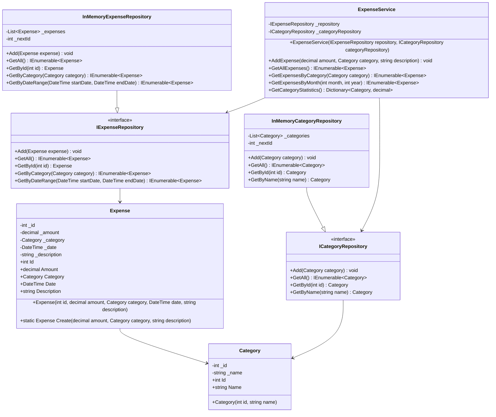

# ExpenseTracker - Class Diagram

## Діаграма класів у форматі Mermaid

## Опис компонентів

### Domain Layer (ExpenseTracker.Domain)
- **Category** - значення для категоризації витрат (їжа, транспорт, розваги тощо)
- **Expense** - сутність для представлення однієї витрати з усіма деталями

### Application Layer (ExpenseTracker.Application)
- **ExpenseService** - бізнес-логіка для управління витратами
- **IExpenseRepository** - контракт для роботи з витратами
- **ICategoryRepository** - контракт для роботи з категоріями

### Infrastructure Layer (ExpenseTracker.Infrastructure)
- **InMemoryExpenseRepository** - реалізація репозиторію в памяті
- **InMemoryCategoryRepository** - реалізація репозиторію категорій в памяті

### Console Layer (ExpenseTracker.Console)
- **Program** - точка входу та консольний інтерфейс користувача
