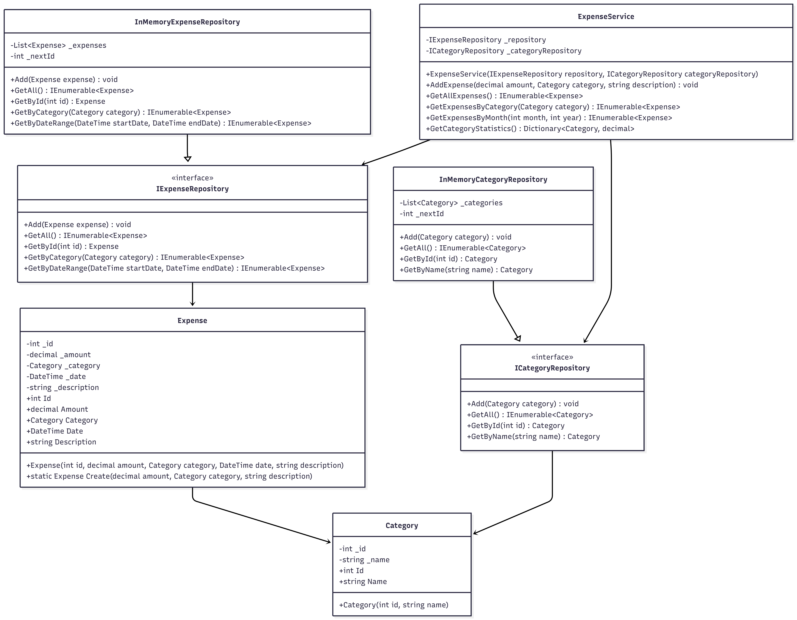

# ExpenseTracker - Class Diagram

## Діаграма класів

## Опис компонентів

### Domain Layer (ExpenseTracker.Domain)
- **Category** - значення для категоризації витрат (їжа, транспорт, розваги тощо)
- **Expense** - сутність для представлення однієї витрати з усіма деталями
- **Entity** - базовий клас для ідентифікації сутностей за ID
- **Result** - тип результату операції з успіхом або помилкою
- **IExpenseRepository** - контракт для роботи з витратами
- **ICategoryRepository** - контракт для роботи з категоріями
- **IExpensePersistence** - контракт для збереження/завантаження витрат у JSON файл

### Application Layer (ExpenseTracker.Application)
- **ExpenseService** - бізнес-логіка для управління витратами
- **ExpenseService** реалізує пошук, статистику, фільтрацію та persistence

### Infrastructure Layer (ExpenseTracker.Infrastructure)
- **InMemoryExpenseRepository** - реалізація репозиторію в пам'яті
- **FileSystemExpenseRepository** - реалізація репозиторію з JSON persistence
- **InMemoryCategoryRepository** - реалізація репозиторію категорій в пам'яті

### Console Layer (ExpenseTracker.Console)
- **Program** - точка входу та консольний інтерфейс користувача
