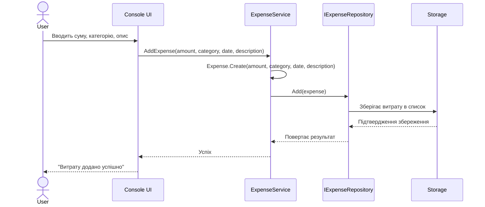
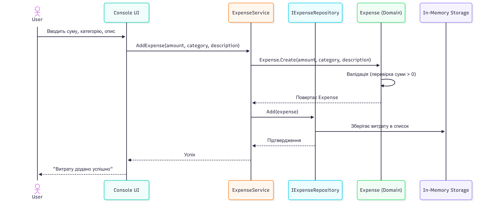
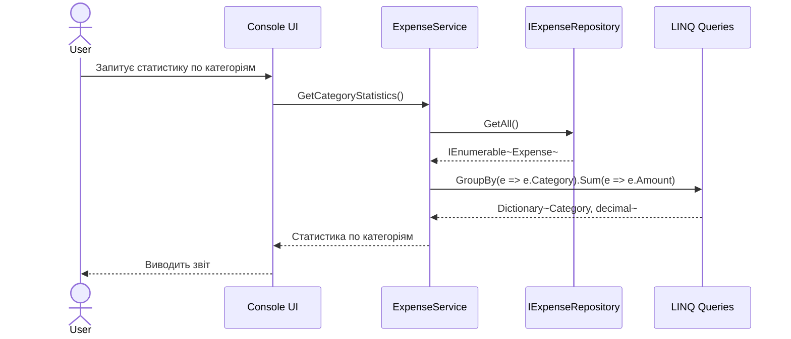
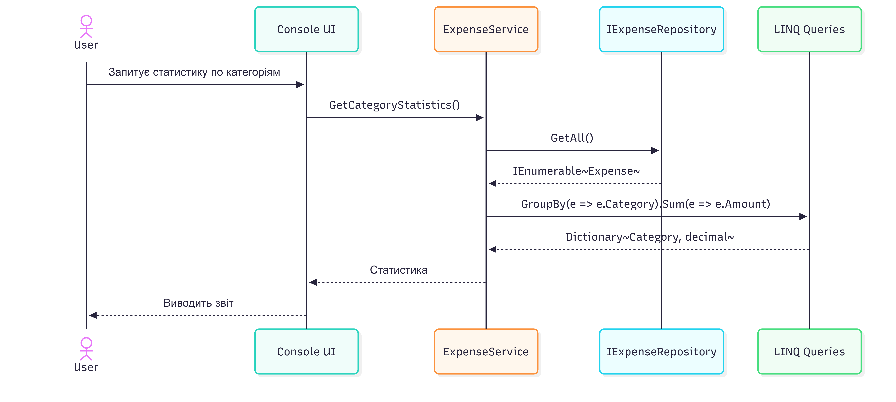
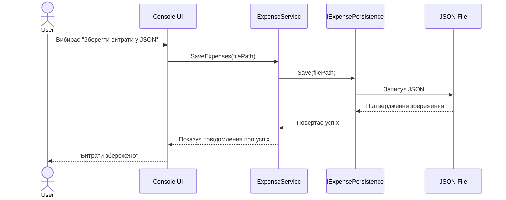
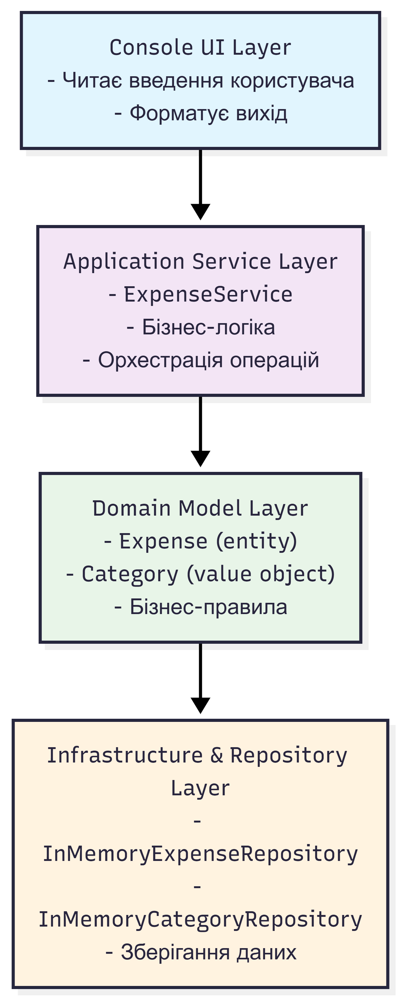

# ExpenseTracker - Sequence Diagrams

## Сценарій: Додавання витрати





## Сценарій: Отримання статистики по категоріям





## Сценарій: Збереження витрат у JSON



## Архітектурні переходи між шарами

```mermaid
flowchart TD
    A[Console UI Layer<br/>- Читає введення користувача<br/>- Форматує вихід] --> B[Application Service Layer<br/>- ExpenseService<br/>- Бізнес-логіка<br/>- Орхестрація операцій]
    B --> C[Domain Model Layer<br/>- Expense (entity)<br/>- Category (value object)<br/>- Бізнес-правила]
    C --> D[Infrastructure & Repository Layer<br/>- InMemoryExpenseRepository<br/>- FileSystemExpenseRepository<br/>- InMemoryCategoryRepository<br/>- Зберігання даних]

    style A fill:#e1f5fe,stroke:#0097a7,stroke-width:2px
    style B fill:#f3e5f5,stroke:#ff9800,stroke-width:2px
    style C fill:#e8f5e9,stroke:#43a047,stroke-width:2px
    style D fill:#fff3e0,stroke:#f57c00,stroke-width:2px
```

