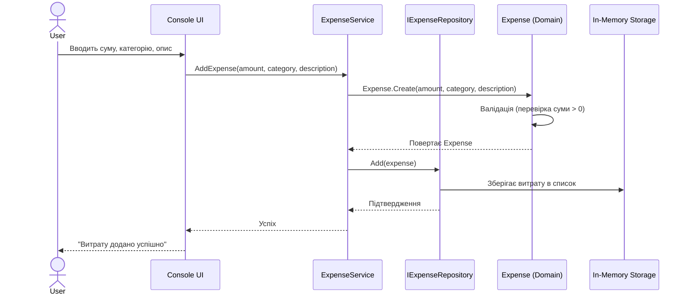
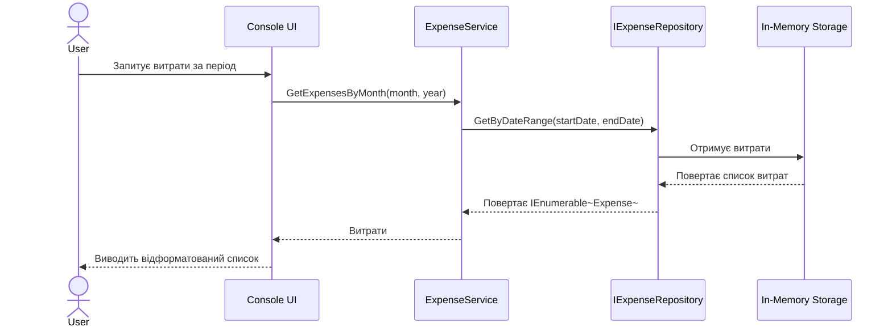
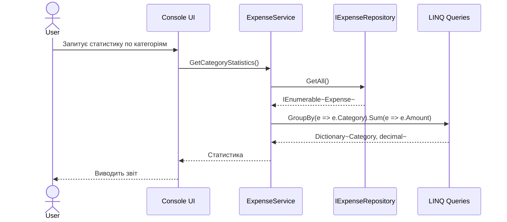

# ExpenseTracker - Sequence Diagram

## Діаграма послідовності для сценарію "Додавання витрати"



## Діаграма послідовності для сценарію "Перегляд витрат"



## Діаграма послідовності для сценарію "Отримання статистики"



## Архітектурні переходи між шарами

```
┌─────────────────────────────────────────────┐
│           Console UI Layer                  │
│ - Читає введення користувача                │
│ - Форматує вихід                            │
└──────────────┬──────────────────────────────┘
               │
               ▼
┌─────────────────────────────────────────────┐
│      Application Service Layer              │
│ - ExpenseService                            │
│ - Бізнес-логіка                             │
│ - Орхестрація операцій                      │
└──────────────┬──────────────────────────────┘
               │
               ▼
┌─────────────────────────────────────────────┐
│       Domain Model Layer                    │
│ - Expense (entity)                          │
│ - Category (value object)                   │
│ - Бізнес-правила                            │
└──────────────┬──────────────────────────────┘
               │
               ▼
┌─────────────────────────────────────────────┐
│    Infrastructure & Repository Layer        │
│ - InMemoryExpenseRepository                 │
│ - InMemoryCategoryRepository                │
│ - Зберігання даних                          │
└─────────────────────────────────────────────┘
```
